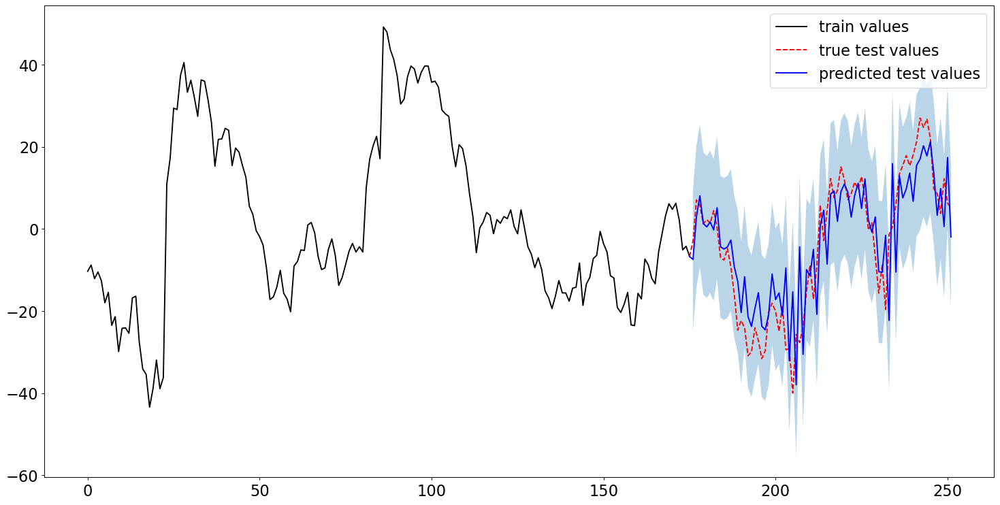

# SJGC-Project

[随机过程大作业](https://cloud.tsinghua.edu.cn/f/ee0ce3608b3b4bd78f6d/?dl=1)

## 文件清单

- <code>data/</code>：此文件夹下存放所需数据，数据格式如下：以股票名为子目录（如<code>adsk/</code>），内部放置不同时间跨度的数据集（如跨度为1年的为<code>1Y.csv</code>，跨度为1个月的为<code>1M.csv</code>）。
- <code>hyperparameters/</code>：此文件夹下存放程序所需的超参数，存放格式为<code>.csv</code>，可以实现一次性读入多组超参，并具有较好的可读性。超参的设定详见[超参设定](#超参设定)。
- <code>imgs/</code>：此文件夹下存放运行所得的可视化结果。
- <code>top.py</code>：运行此文件，读入<code>hyperparameters/</code>下的超参，即可在<code>imgs/</code>中生成可视化结果。
- <code>my_gpr.py</code>：此文件中的<code>MyGPR</code>类简洁明了地定义了一个高斯回归模型，其对外接口简述如下：
  - <code>fit_params(self)</code>：对模型参数进行优化。
  - <code>predict(self)</code>：对测试集进行一次性预测（并未显式地考虑时序因素）。
  - <code>seqeuntial_predict(self)</code>：对测试集进行短期时序预测。亦即，每次利用前面特定数量的带标签的“真实数据集”，预测下一时刻的测量值。而当下一时刻的测量值给出后，便将其也纳入到“真实数据集”中。
  - <code>draw_prediction(self, img_name, prefix, fig_size)</code>：可视化结果绘制函数。传入参数简介：
    - <code>img_name</code>：生成的图片的名称。
    - <code>prefix</code>：图片存放的相对路径，默认为<code>'./imgs/'</code>。
    - <code>fig_size</code>：生成图片大小，默认为<code>(10, 20)</code>。

## 超参设定

- <code>name</code>：股票名称。
- <code>expansion</code>：数据集时间跨度。
- <code>train_ratio</code>：训练数据（优化参数所用数据/“已知”数据）所占总数据的比例。
- <code>selection_mode</code>：数据集分割方式。目前支持两个方式：
  - <code>random</code>：随机选取训练集和测试集，不考虑数据时序。此分割方式下，高斯回归模型用于“插值”。
  - <code>truncated</code>：考虑数据时序，将前期数据作为训练集，后期数据作为测试集。此分割方式下，高斯回归模型用于时序预测。
- <code>kernel_name</code>：核函数类型。目前支持三种核函数：
  - <code>sek</code>：squared exponential kernel
  - <code>pk</code>：periodic kernel
  - <code>lpk</code>：local periodic kernel
- <code>fit_param_times</code>：参数优化次数（每一次选取不同的初始值）。
- <code>log_sample_flag</code>：是否采用“对数采样”，推荐置为1（开启）。
- <code>sequential_predict_flag</code>：是否采用短期时序预测。当任务是时序预测（<code>selection_mode</code>为<code>truncated</code>）时，建议置为1（开启）。

## 部分可视化结果

- 短期时序预测

- 利用GPR实现“插值”

